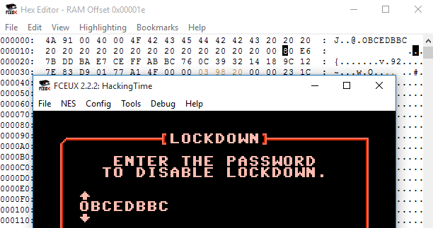

## Hacking Time (re, 200p, 180 solves)

> We’re getting a transmission from someone in the past, find out what he wants.  
> [HackingTime.nes](HackingTime.nes)

Pobieramy udostępniony plik, który okazuje się obrazem aplikacji na Nintendo Entertainment System, 8-bitową konsolę, którą każdy zna i lubi :). Zadanie polega na podaniu hasła, które jednocześnie będzie flagą w tym zadaniu.

Zamiast statycznie analizować to zadanie, spróbujemy rozwiązać je "na żywo" w emulatorze FCEUX z jego zintegrowanym debuggerem. Krótka eksperymentacja pozwala nam stwierdzić, że sprawdzenie hasła oprócz zmiany samego bufora z hasłem w pamięci modyfikuje nam również bajty od offsetu `0x1e`.



Ustawiamy w takim razie read breakpoint na tym adresie i przy ponownej próbie sprawdzenia hasła trafiamy na następujący fragment:

```gas
 00:8337:A0 00     LDY #$00
>00:8339:B9 1E 00  LDA $001E,Y @ $001E = #$80
 00:833C:D0 08     BNE $8346
 00:833E:C8        INY
 00:833F:C0 18     CPY #$18
 00:8341:D0 F6     BNE $8339
 00:8343:A9 01     LDA #$01
 00:8345:60        RTS -----------------------------------------
 00:8346:A9 00     LDA #$00
 00:8348:60        RTS -----------------------------------------
 ```

Jest to pętla, która sprawdza nam `0x18` znaków zaczynając od naszego offsetu `0x1e`. Jeżeli któryś z bajtów nie wynosi 0 to funkcja wychodzi z wartością 0, a w przeciwnym wypadku z 1. Bezpośrednia zmiana IP na instrukcję spod `0x8343` i wznowienie programu potwierdza nam komunikatem o sukcesie, że to jest celem zadania. Musimy zatem wprowadzić takie hasło by bajty spod offsetu `0x1e` wynosiły same zera. Możemy dokonać statycznej analizy albo literka po literce zbruteforce'ować nasze hasło (a to dzięki temu, że zmiana następnych liter nie zmienia nam bajtów poprzednich). Postanowiliśmy skorzystać z tej drugiej metody.

Hasłem oraz flagą okazał się ciąg: `NOHACK4UXWRATHOFKFUHRERX`. Cała aplikacja jest oczywiście zabawnym nawiązaniem do filmu "Kung Fury" :)!