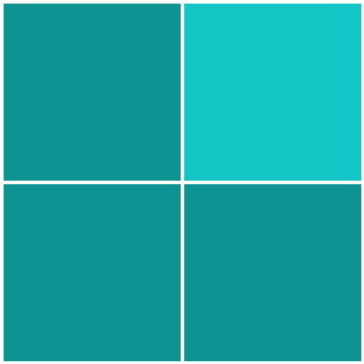

## Colors (ppc/Programming, 100p)

### PL Version
`for ENG version scroll down`

System wyświetlał na stronie internetowej obrazek złożony z kwadratów. Wsystkie kwadraty oprócz jednego miały taki sam kolor - jeden z nich miał lekko inny odcień. Celem zadania było kliknięcie w ten odmienny kwadrat. System rejestrował gdzie kliknęliśmy i na tej podstawie oceniał poprawność rozwiązania i prezentował kolejny przykład.
Celem było rozwiązanie kilkudziesieciu przykładów pod rząd w celu uzyskania flagi.

Aby rozwiązać zadany problem przygotowaliśmy skrypt w pythonie z użyciem Python Images Library dostępny [tutaj](colors.py).
Skrypt pobiera zadany obraz, wylicza rozkład kolorów pikseli i na tej podstawie wybiera najrzadziej występujący kolor (pomiajając biały, który oddziela kwadarty od siebie). Następnie skanujemy obraz w poszukiwaniu jakiegoś piksela tego koloru i zwracamy pozycję tego piksela jako rozwiązanie.

	def getPixel(picture_path):
		fd = urllib.urlopen(picture_path)
		image_file = io.BytesIO(fd.read())
		im = Image.open(image_file)
		colors_distribution = im.getcolors()
		non_white = [color for color in colors_distribution if color[1] != (255, 255, 255)]
		ordered = sorted(non_white, key=lambda x: x[0], reverse=False)
		print(ordered[0])
		width, height = im.size
		for index, color in enumerate(im.getdata()):
			if color == ordered[0][1]:
				y = index / width
				x = index % width
				return x, y

Po rozwiązaniu kilkudziesięciu przykładów otrzymujemy: `TMCTF{U must have R0807 3Y3s!}`

### ENG Version

The system displays on a webpage an image consisting of squares. All but one have the same color - one has a slighly different shade. The task was to click in on the square with different color. The system would register the click location and decide if our solution is correct. We had to solve multiple consecutive examples in order to get the flag.

To solve the task we prepared a python script using Python Images Library available [here](colors.py).
The script downloads the picture, calculates the colors disitrbution and base don this selects the least frequent color (omitting white, which separates the squares). Next we can the picture looking for a pixel with this color and we return this pixel position as the solution.

	def getPixel(picture_path):
		fd = urllib.urlopen(picture_path)
		image_file = io.BytesIO(fd.read())
		im = Image.open(image_file)
		colors_distribution = im.getcolors()
		non_white = [color for color in colors_distribution if color[1] != (255, 255, 255)]
		ordered = sorted(non_white, key=lambda x: x[0], reverse=False)
		print(ordered[0])
		width, height = im.size
		for index, color in enumerate(im.getdata()):
			if color == ordered[0][1]:
				y = index / width
				x = index % width
				return x, y

After few dozens of examples we finally get: `TMCTF{U must have R0807 3Y3s!}`