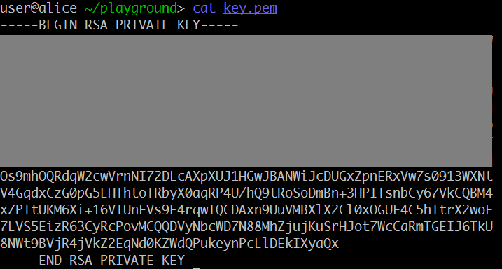

## equation (Crypto, 2p)

	Here is a RSA private key with its upper part masked. Can your recover the private key and decrypt the file?

###ENG
[PL](#pl-version)

We have the picture:



from which we can extract the base64 of the private key part:

```
Os9mhOQRdqW2cwVrnNI72DLcAXpXUJ1HGwJBANWiJcDUGxZpnERxVw7s0913WXNt
V4GqdxCzG0pG5EHThtoTRbyX0aqRP4U/hQ9tRoSoDmBn+3HPITsnbCy67VkCQBM4
xZPTtUKM6Xi+16VTUnFVs9E4rqwIQCDAxn9UuVMBXlX2Cl0xOGUF4C5hItrX2woF
7LVS5EizR63CyRcPovMCQQDVyNbcWD7N88MhZjujKuSrHJot7WcCaRmTGEIJ6TkU
8NWt9BVjR4jVkZ2EqNd0KZWdQPukeynPcLlDEkIXyaQx
```

Next we read a bit about ANS1 DER ( https://en.wikipedia.org/wiki/Abstract_Syntax_Notation_One#Example_encoded_in_DER ) format and what are the values in the rsa private key file.
It turns out that that the file contains:

```
RSAPrivateKey ::= SEQUENCE {
  version           Version,
  modulus           INTEGER,  -- n
  publicExponent    INTEGER,  -- e
  privateExponent   INTEGER,  -- d
  prime1            INTEGER,  -- p
  prime2            INTEGER,  -- q
  exponent1         INTEGER,  -- d mod (p-1)
  exponent2         INTEGER,  -- d mod (q-1)
  coefficient       INTEGER,  -- (inverse of q) mod p
  otherPrimeInfos   OtherPrimeInfos OPTIONAL
}
```

And the extraction is quite simple - we need to find byte `02` which denotes start of an integer and then the next byte specifies number of bytes that follow.
We wrap this in a short script:

```python
def get_dp_dq_qinv(key64):
    result = []
    key_tab = list(b64decode(key64))
    print(key_tab)
    i = 0
    while i < len(key_tab):
        x = key_tab[i]
        if x == 0x2:  # integer start
            length = key_tab[i + 1]
            octets = key_tab[i + 2: i + 2 + length]
            value = int.from_bytes(octets, byteorder="big")
            result.append(value)
            print(value)
            i += 2 + length
        else:
            i += 1
    return tuple(result)


dp, dq, qinv = get_dp_dq_qinv(key64)
```

And thus we get 3 integers, which are (accoring for private key der format): dp, dq and qinv. 

dp = 11188888442779478492506783674852186314949555636014740182307607993518479864690065244102864238986781155531033697982611187514703037389481147794554444962262361

dq = 1006725509429627901220283238134032802363853505667837273574181077068133214344166038422298631614477333564791953596600001816371928482096290600710984197710579

qinv = 11196804284042107547423407831525890933636414684075355664222816007929037065463409676450144484947842399975707117057331864113464711778199061912128258484839473


We also know a bunch of lower bytes of the `q` prime factor, however we didn't need it after all.
Instead we follow the algorithm proposed in https://eprint.iacr.org/2004/147.pdf and implement the recovery algorithm:

```python
def recover_parameters(dp, dq, qinv, e):
    results = []
    d1p = dp * e - 1
    for k in range(3, e):
        if d1p % k == 0:
            hp = d1p // k
            p = hp + 1
            if is_prime(p):
                d1q = dq * e - 1
                for m in range(3, e):
                    if d1q % m == 0:
                        hq = d1q // m
                        q = hq + 1
                        if is_prime(q):
                            if (qinv * q) % p == 1 or (qinv * p) % q == 1:
                                results.append((p, q, e))
                                print(p, q, e)
    return results
```

Which returns a single solution:

p= 12883429939639100479003058518523248493821688207697138417834631218638027564562306620214863988447681300666538212918572472128732943784711527013224777474072569 

q = 12502893634923161599824465146407069882228513776947707295476805997311776855879024002289593598657949783937041929668443115224477369136089557911464046118127387

e = 65537

And now it's just a matter of recovering the `d` exponent via standard EGCD algoritm and decrypting RSA:

```python
def egcd(a, b):
    u, u1 = 1, 0
    v, v1 = 0, 1
    while b:
        q = a // b
        u, u1 = u1, u - q * u1
        v, v1 = v1, v - q * v1
        a, b = b, a - q * b
    return u


def get_d(p, n, e):
    q = n / p
    phi = (p - 1) * (q - 1)
    d = egcd(e, phi)
    if d < 0:
        d += phi
    return d


with open("flag.enc", "rb") as input_file:
    n = p * q
    data = input_file.read()
    ct = bytes_to_long(data)
    d = get_d(p, n, e)
    pt = pow(ct, d, n)
    print("pt: " + long_to_bytes(pt))
```

Which gives us `0ctf{Keep_ca1m_and_s01ve_the_RSA_Eeeequati0n!!!}`

###PL version
