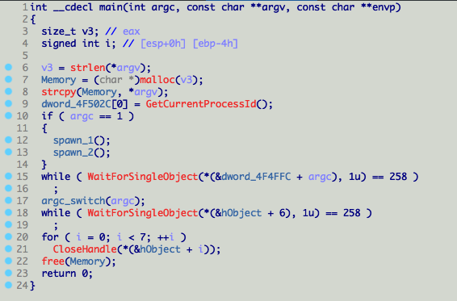
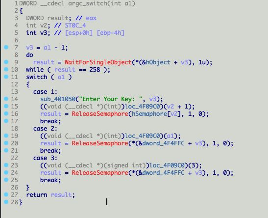
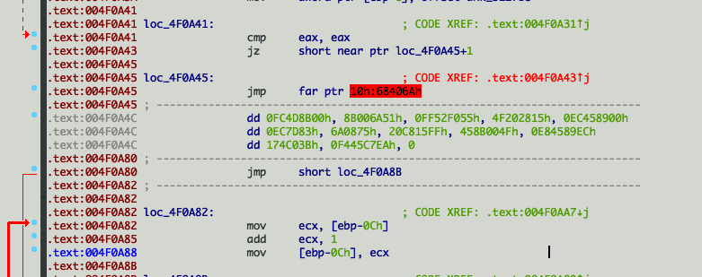
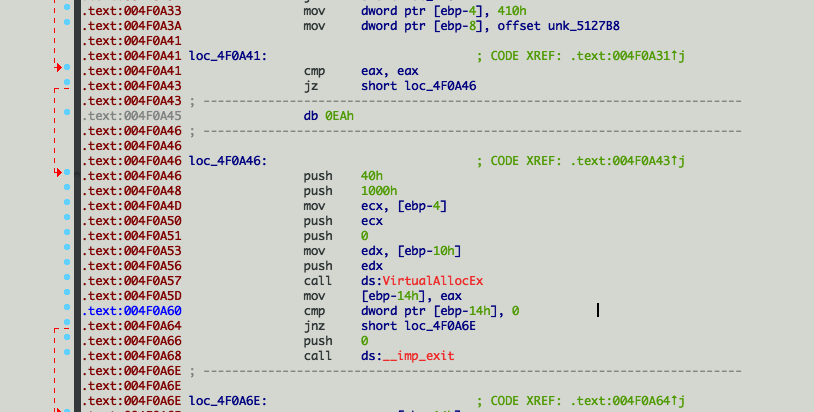
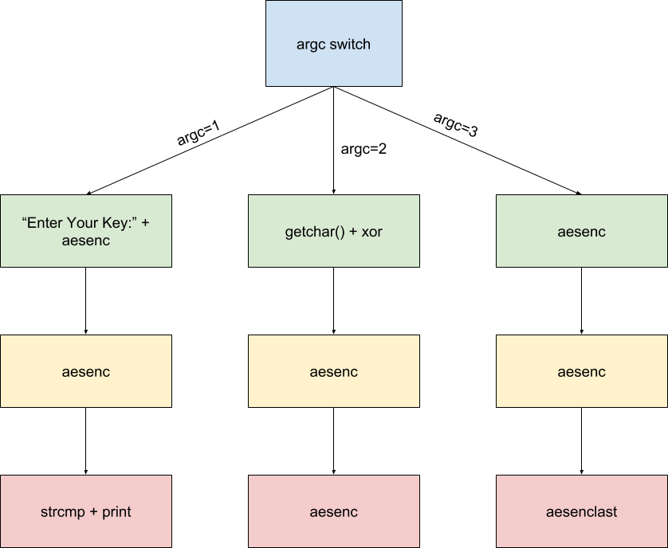
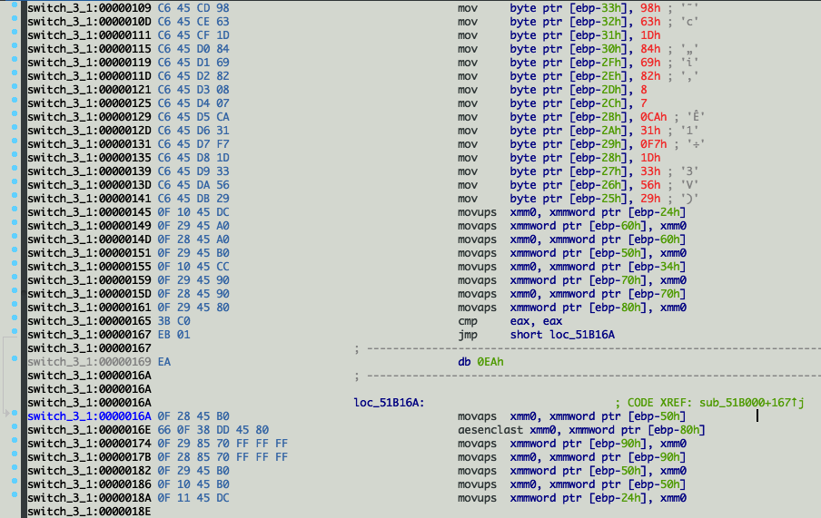

# XSS (re, 6 solves, 900p)

> The flag format is MeePwnCTF{correct_input} 

> Unzip password: MeePwn


Here's the main function:




If the program is ran without any arguments (and thus argc==1), it spawns 2 additional processess with args `1` and `1 2`, and goes on to execute `argc_switch`:



Generally, the program contains 3 different processes that check the password asynchronically using thread locks.

Before we get a clear assembly though, there are 2 obfuscation tricks that we have to go through:

There are conditional jumps that are always taken and the next instruction after the bogus `jz` is a bad instruction to screw up our disassembly: (notice the `addr+1`)



We can correctly set the data/code stuff in ida and get a pretty good dissasembly:



Additionaly, if we want IDA to recognize this code as a function we're gonna need to patch the `jz` instructions to `jmp`.


Next thing is encrypted code:

``` c++
BOOL __cdecl switch_stuff(LPVOID lpParameter)
{
  void *v2; // [esp+1Ch] [ebp-14h]
  HANDLE hProcess; // [esp+20h] [ebp-10h]
  SIZE_T i; // [esp+24h] [ebp-Ch]
  _BYTE *lpBuffer; // [esp+28h] [ebp-8h]
  SIZE_T dwSize; // [esp+2Ch] [ebp-4h]

  hProcess = OpenProcess(dwDesiredAccess, 0, process_stuff.field_0);
  if ( !hProcess )
  {
    exit(0);
  }
  dwSize = 0;
  lpBuffer = 0;
  if ( lpParameter == 1 )
  {
    dwSize = 1024;
    lpBuffer = subfun_1;
  }
  if ( lpParameter == 2 )
  {
    dwSize = 864;
    lpBuffer = sunfun_2;
  }
  if ( lpParameter == 3 )
  {
    dwSize = 1040;
    lpBuffer = subfun_3;
  }
  v2 = VirtualAllocEx(hProcess, 0, dwSize, 0x1000u, 0x40u);
  if ( !v2 )
  {
    exit(0);
  }
  for ( i = 0; i < dwSize; ++i )
  {
    lpBuffer[i] ^= 0x33u;
  }
  if ( !WriteProcessMemory(hProcess, v2, lpBuffer, dwSize, 0) )
  {
    exit(0);
  }
  if ( !CreateRemoteThread(hProcess, 0, 0, v2, lpParameter, 0, 0) )
  {
    exit(0);
  }
  return CloseHandle(hProcess);
}
```

Basing on the number of arguments, a different code section is decrypted and injected into a new thread. Dexoring the buffer and loading the buffers as additional binaries in IDA works pretty good.

Here's a tree of execution that sums it up pretty well:



Each node creates the next one by writing code hardcoded in the function body to itself using WriteProcessMemory:


The `aesenc` block represents a code section that encrypts the global string with a one round of aes by using the `aesenc` instruction and a hard-coded key:



So:

* The 16-byte key is read from stdin using getchar
* The input is xored with a hard-coded key
* It's encrypted 9 times with a single round of aes with a hard-coded key
* `aesenclast` is the last round of aes
* The outcome buffer is compared with a hardcoded string
* The result is printed

So all we have to do is reverse the operations and we'll get the flag.

We can't just shuffle the aes rounds though, so we have 2 options:

 * Analyze the thread locks order and come up with the original execution order
 * Brute-force it (#yolo)

Obviously, brute-forcing is faster as there are only 8! possible combinations (even less when when we take into consideration the block order).

We whim up a quick python script that does the job for us:

``` python
import itertools
from aes import AES
from crypto_commons.generic import xor_string, is_printable

def convert_array_to_strings(arr):
  return "".join(map(chr, arr))

possible_rounds = [
  [0x45,0x33,0x7E,0x3C,0xF0,0x7F,0x2D,0xAC,0x33,0x44,0x3B,0x75,0x48,0x2A,0xC5,0x46,],
  [0x3E,0x43,0x95,0x3C,0x69,0xD0,0x73,0x67,0x22,0x97,0xD1,0xB1,0xA3,0x61,0xFD,0x4A,],
  [0x4D,0xF0,0xEC,0x1A,0x3D,4,0xA9,0xDB,0xF5,0xD5,8,0x1A,0x80,0x70,0x93,6,],
  [0x60,0x9D,0x47,0x31,0xB5,0xDD,0x36,0x7E,0xEF,0x99,0x7A,0xD8,0x49,0x5C,0x45,0x23,],
  [0xFA,0xEC,0xDB,0xBB,0x93,0xB2,0x3A,0xEF,0x68,0xE4,0xBE,0x6D,0x2F,0xF6,0x6B,0x4C,],
  [0x2E,0xEB,0xCF,0x46,5,0xAE,0x3D,0x94,0xBA,0x8C,0xCC,0xF4,0x4C,0xA1,0x1D,0x4C,],
  [0xBA,0xF0,0xAB,0x1F,0xAC,0x2F,0x58,0x81,0xF1,0x25,0xB1,0x59,0xF9,0x79,0xDE,3,],
  [0x34,0xAF,0xFF,0x57,0x51,0x3A,0xF,0xEC,0x8B,0xA0,0xE6,0x5F,0x8C,0x98,0x60,0x78,],
  [0x74,0xF9,0xC5,0x42,0x7F,0x7A,0x6E,0xE2,0xB1,0x1F,0x2C,0xC2,0x18,4,0xB8,0xF7,],
]
last = [0xA,0x98,0x63,0x1D,0x84,0x69,0x82,8,7,0xCA,0x31,0xF7,0x1D,0x33,0x56,0x29]
ct = [0x68,0xCE,0xDF,0xDD,0x58,0x6C,0x37,0xE4,0xC4,0xE1,0xAC,0xB4,9,0x7F,0x97,0xA4]
xorkey = [0x6A, 0x15, 0x6D, 0xB, 0x9D, 0xF0, 0xC2, 0x34, 0x74, 0x8A, 0xD4, 0x4F, 0x50, 0x84, 0xA0, 0x7F, ]

possible_rounds = map(convert_array_to_strings, possible_rounds)
ct = convert_array_to_strings(ct)
last = convert_array_to_strings(last)
xorkey = convert_array_to_strings(xorkey)

for i in itertools.permutations(possible_rounds):
  A = AES()
  rounds = i
  try_ct = A.sr_decryptlast(ct, last)
  for r in rounds:
    try_ct = A.sr_decrypt(try_ct, r)
    print(xor_string(try_ct, xorkey))
```

And get the most printable key: `5B4D656550776E5D` \o/