# CONFidence2019 CTF Post Mortem

> by msm

Hi all, thanks for playing CONFidence 2019 CTF! Now the CTF is over, we want to dump some data, share some perspective, and show how things worked from behind the scenes.

## 1. Challenges

546 teams registered, of which 522 solved at least one challenge. We prepared 16 challenges, all of which were solved.

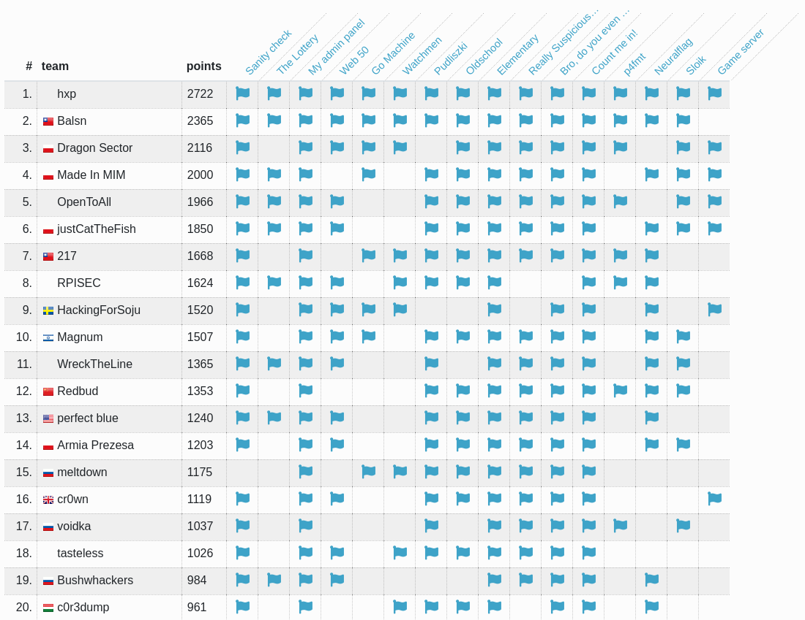

The hardest challenge (judging by the number of solves) was game_server. The easiest challenge (ignoring the sanity check) was admin_panel, closely followed by elementary and count.

Full 

| challenge_name | count | 
| ---------------| ------|
| game server |   7 |
| p4fmt |    10 |
| go machine |    10 |
| lottery |    11 |
| watchmen |    13 |
| sloik |    14 |
| neuralflag |    22 |
| web_50 |    29 |
| pudliszki |    37 |
| oldschool |    37 |
| really suspicious acronym |    52 |
| bro, do you even lift |    65 |
| count me in! |   115 |
| elementary |   123 |
| my admin panel |   151 |
| sanity check |   522 |

In retrospect, we should've added both more hard challenges. We underestimated you and thought that 24hours is not enough time to hack all of our tasks. We were wrong ;). On the other hand, only one team managed to solve all our challenges (congratz, hxp), so it's not too bad.

On the other hand, some people complained that even the easiest tasks were challenging, and wished for something more beginner-friendly. We'll work on that next time!

Also, we need more pwn challenges. We had some of them planned, but life happened and they were not ready for the CTF. Sorry to all the pwn-lovers that had nothing to do (except for the pwning the kernel in p4fmt, of course). 

## 2. Survey

Ok, we had some challenges, but were they any good? Let's ask the players.

Our survey was filled in by 39 people, most of whom were satisfied with the CTF:

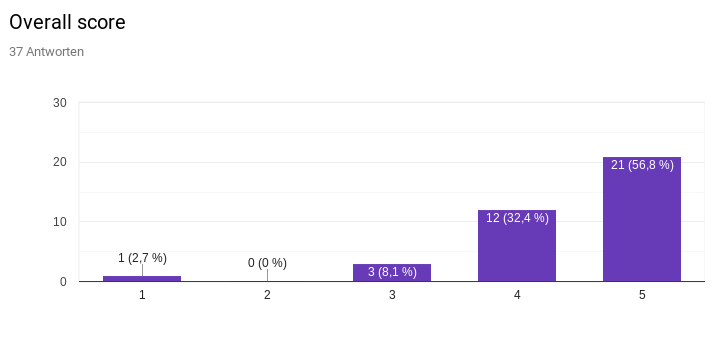

Thanks, we're glad you liked it!

Most participants liked the difficulty level (at least I think so):

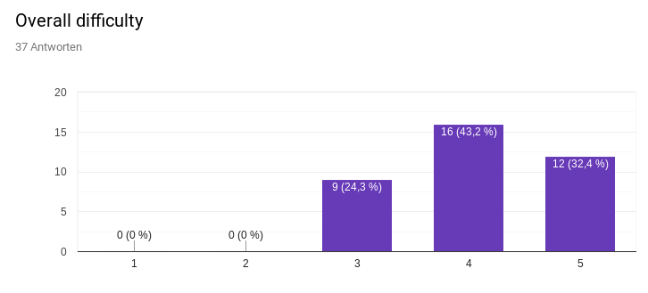

You want more web and pwn challenges. We'll try to deliver next time!

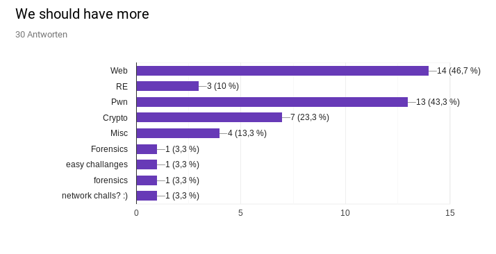

And you want less... RE? Sorry folks, no can do. You can pry RE challenges from our cold, dead hands :P. RE = the best category, change my mind.

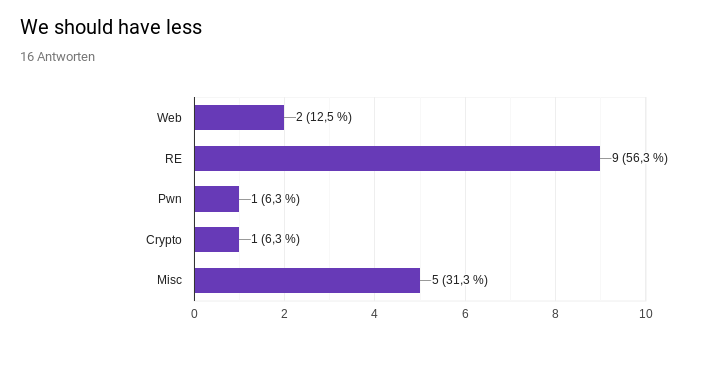

The best challenge, according to you, was p4fmt. I agree, hacking a kernel has a certain ring to it. Additionally, it was relatively easy (for a kernel exploit that is), so it's a perfect opportunity to start your <del>descent into madness</del> journey into the awesome world of ring0 exploits.

PS. It was a pain to set up. Glad it was worth it.

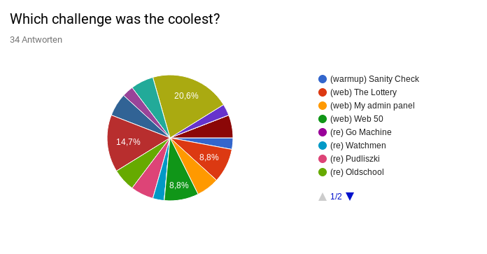

And which challenge was the worst, the most loathed, which challenge was hated with the burning passion? `Sanity Check`, apparently:

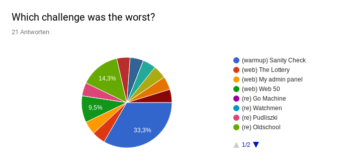

I hope people selected it just because all the other challenges was perfect ;). Although...

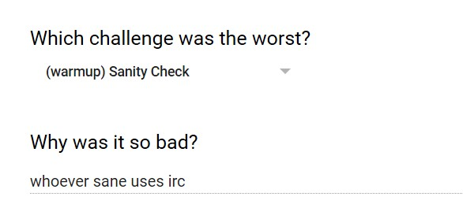

Can't argue with that logic.

## 3. Infrastructure

Oh boy. I was primarily responsible for it (with a lot of help from @des and @rev) so I could talk hours about this. It has also cost me two almost sleepless nights (that's what you get for delaying everything to the last minute), so I'm glad it's over now.

We decided to go with a quite unusual approach. We've used a kubernetes cluster hosted in DigitalOcean:

I have to say, I'm really satisfied with the results. The whole infrastructure cost literally pennies (ok, $10.18 exactly). We deployed and tested the challenges before the CTF on a small, 2-node cluster, scaled up to 4 nodes just before the CTF, and downscaled to a single node now the CTF is over. I'm also planning to migrate the challenges to my own server soon, so we won't have to pay anymore and everything is still up.

Overall, using kubernetes turned out to be quite nice (though a pain to set up sometimes). For starters, we get this nice dashboard, with restart buttons and service statuses:

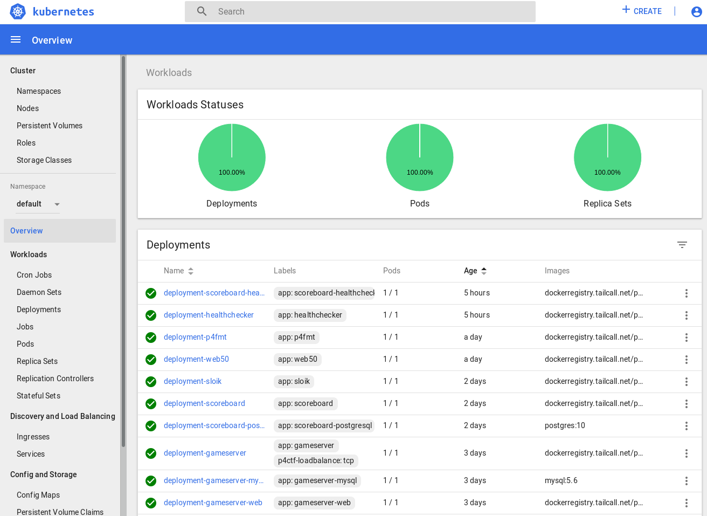

It also allowed us to do some tricky admin stuff in case of performance problems, like migrating challenges to other nodes etc.

We used Cloudflare to save on traffic and reduce the risk of a DDoS attack. Luckily it was not necessary, but it still saved us a lot of network traffic:

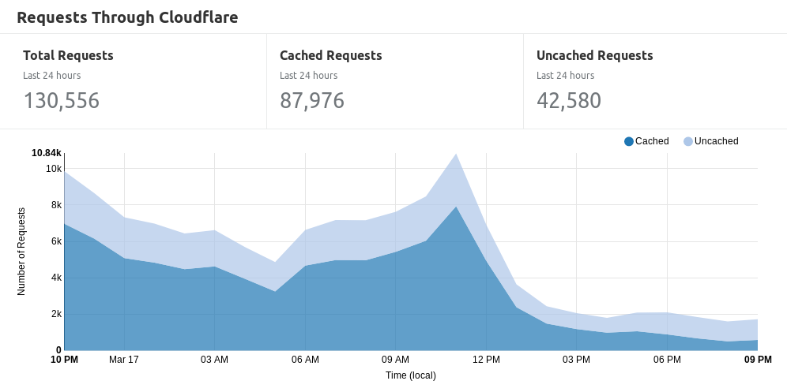

Countries are not a big surprise too, but it looks like our CTF was really popular in Germany!

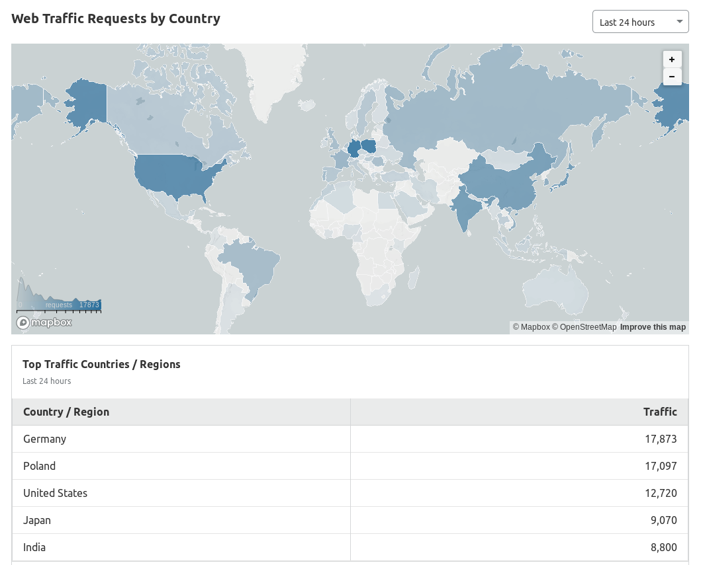

## 4. Monitoring

You can't fix your CTF unless you know what's broken. That's why we implemented quite a lot of monitoring and healthchecks and set up a bot to ping us when things go south:

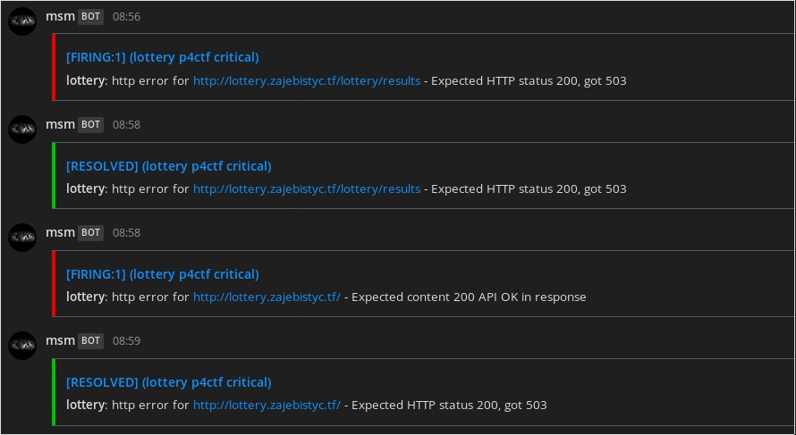

It worked reasonably well, and we had a chance to react quickly - hopefully before players noticed the problem. Fortunately, everything was quite stable and we didn't have a lot of crashes.

Most of our performance problems were due to people drowning lottery and sloik with thousands of request per second. It was unfortunate because both of them could be solved (in an intended way) with less than five requests. We've finally decided to implement POW for sloik because as far as we know it didn't stop any real exploit (both intended solution and a proper version of race condition work with POW - PM me if you don't believe). For the lottery, we decided to just deal with it, because we suspect that the challenge was solved by some teams by just sending a ton of requests per second for hours and having a lot of luck - so adding a POW would be unfair to other teams, and we decided to just deal with it. 

Some pretty graphs from our internal grafana:

As you can see, there were few hot moments, but everything calmed down at the end (POW for sloik helped a lot too).

## 5. Flags

## 6. Closing thoughts

Thanks everyone for playing!